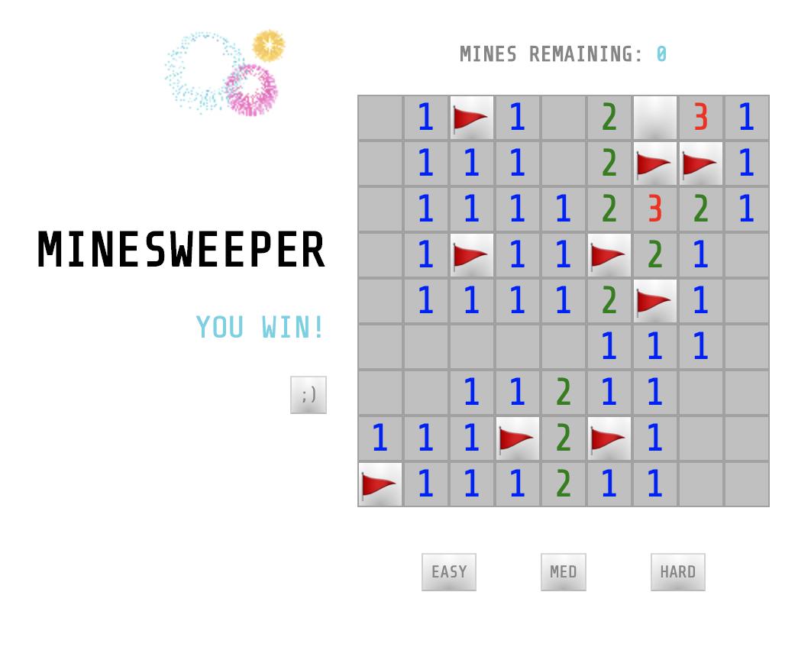
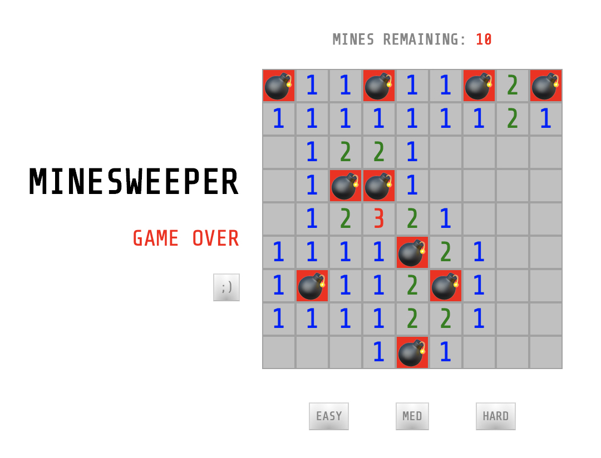
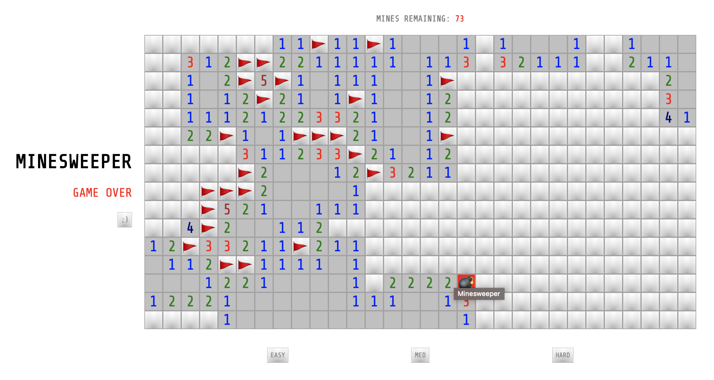

# Minesweeper

## The game you don't mine mining.

### About

Minesweeper is a single player puzzle game originating from the 1960's. A specific number of mines are randomly generated on a gameboard. The goal is to reveal all the cells on the board without mines. Revealing a mine, will result in a GAME OVER. 

Clues, in the form of numbers, help you locate the cells that contain the mines. The numbered cell, dictates how many mines exist within the 8 cells adjacent to it. Clicking on a cell with no adjacent mines will 'clear' a section of the board without mines. Flags may be placed on cells that you think are mines, and flagged cells cannot be opened until the flag is removed. 

### Play it now!  https://alannatai.github.io/minesweeper/

### Instructions

1. Click on a cell to reveal it. If a mine is clicked the game will end. 

2. Clicking on a cell with no adjacent mines will clear a part of the board with no mines. 

3. Numbers represent the number of mines that exist in the 8 spots adjacent to it. 

4. Right click to place a flag that you think is a mine. Flagged cells cannot be opened until the flag is removed. Right click a flag again to remove it.

5. You may right click a number to clear the 8 spaces surrounding it. Spaces will only clear if the correct amount of flags are placed next to it. Spaces will clear whether the flags are placed correctly or not, so be sure the flags are placed correctly.

6. The game is won when all the spaces with no mines are revealed!

### List of Technologies

- Javascript
- HTML/CSS
- jQuery

### Next Steps...

- Implement a '?' marker when you are not sure which cell is a mine
- Optimize the number generator by only looping through the mines and incrementing the adjacent mine count vs. the whole board
- Refactor, refactor, REFACTOR...

### 